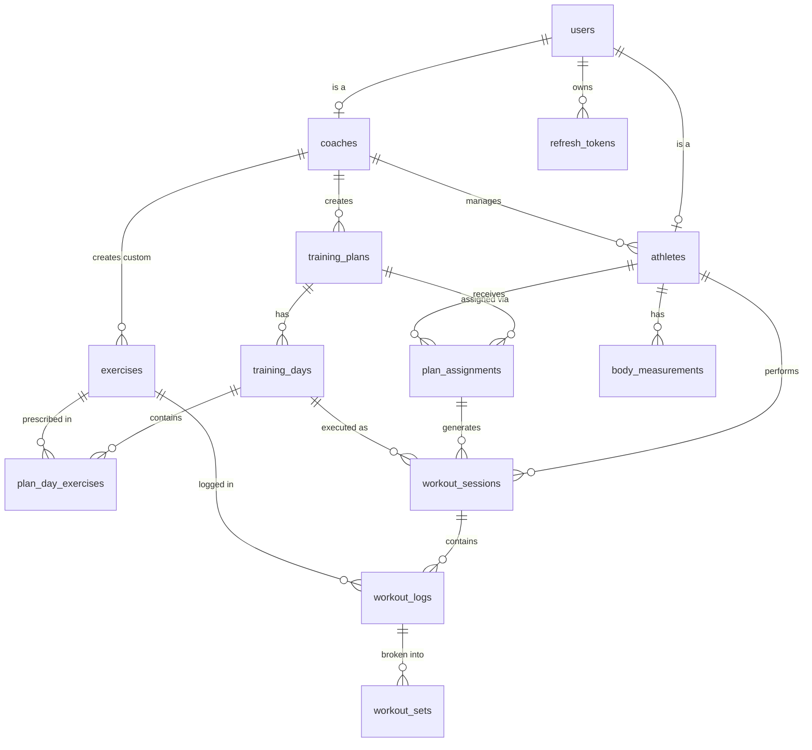

# SCHEMA.md — Schema de Base de Datos

DDL completo con índices, comentarios y relaciones.

---

## Diagrama de entidades (Mermaid)



---

## DDL Completo

### Extensiones requeridas

```sql
CREATE EXTENSION IF NOT EXISTS "uuid-ossp";
CREATE EXTENSION IF NOT EXISTS timescaledb;
```

---

### users

```sql
CREATE TYPE user_role AS ENUM ('coach', 'athlete');

CREATE TABLE users (
  id           UUID PRIMARY KEY DEFAULT uuid_generate_v4(),
  email        VARCHAR(255) NOT NULL UNIQUE,
  password_hash VARCHAR(255) NOT NULL,
  role         user_role NOT NULL,
  created_at   TIMESTAMPTZ NOT NULL DEFAULT NOW(),
  updated_at   TIMESTAMPTZ NOT NULL DEFAULT NOW()
);

CREATE INDEX idx_users_email ON users(email);
```

---

### coaches

```sql
CREATE TABLE coaches (
  id         UUID PRIMARY KEY DEFAULT uuid_generate_v4(),
  user_id    UUID NOT NULL UNIQUE REFERENCES users(id) ON DELETE CASCADE,
  name       VARCHAR(100) NOT NULL,
  bio        TEXT,
  avatar_url VARCHAR(500),
  created_at TIMESTAMPTZ NOT NULL DEFAULT NOW(),
  updated_at TIMESTAMPTZ NOT NULL DEFAULT NOW()
);
```

---

### athletes

```sql
CREATE TABLE athletes (
  id         UUID PRIMARY KEY DEFAULT uuid_generate_v4(),
  user_id    UUID NOT NULL UNIQUE REFERENCES users(id) ON DELETE CASCADE,
  coach_id   UUID NOT NULL REFERENCES coaches(id),
  name       VARCHAR(100) NOT NULL,
  birthdate  DATE,
  avatar_url VARCHAR(500),
  timezone   VARCHAR(50) NOT NULL DEFAULT 'America/Argentina/Buenos_Aires',
  created_at TIMESTAMPTZ NOT NULL DEFAULT NOW(),
  updated_at TIMESTAMPTZ NOT NULL DEFAULT NOW()
);

CREATE INDEX idx_athletes_coach ON athletes(coach_id);
```

---

### exercises

```sql
CREATE TABLE exercises (
  id             UUID PRIMARY KEY DEFAULT uuid_generate_v4(),
  name           VARCHAR(200) NOT NULL,
  category       VARCHAR(100) NOT NULL,  -- 'strength', 'cardio', 'flexibility'
  muscle_groups  TEXT[] NOT NULL DEFAULT '{}',
  video_url      VARCHAR(500),
  instructions   TEXT,
  created_by     UUID REFERENCES coaches(id) ON DELETE SET NULL,  -- NULL = global
  created_at     TIMESTAMPTZ NOT NULL DEFAULT NOW(),
  updated_at     TIMESTAMPTZ NOT NULL DEFAULT NOW()
);

CREATE INDEX idx_exercises_category ON exercises(category);
CREATE INDEX idx_exercises_created_by ON exercises(created_by);
-- Full text search en nombre
CREATE INDEX idx_exercises_name_fts ON exercises USING gin(to_tsvector('spanish', name));
```

---

### training_plans

```sql
CREATE TABLE training_plans (
  id           UUID PRIMARY KEY DEFAULT uuid_generate_v4(),
  coach_id     UUID NOT NULL REFERENCES coaches(id) ON DELETE CASCADE,
  name         VARCHAR(200) NOT NULL,
  description  TEXT,
  total_weeks  INT CHECK(total_weeks > 0),   -- NULL = sin fin definido
  cycle_weeks  INT CHECK(cycle_weeks > 0),   -- NULL = no cicla
  auto_cycle   BOOLEAN NOT NULL DEFAULT FALSE,
  created_at   TIMESTAMPTZ NOT NULL DEFAULT NOW(),
  updated_at   TIMESTAMPTZ NOT NULL DEFAULT NOW(),

  CONSTRAINT cycle_requires_total_weeks
    CHECK (cycle_weeks IS NULL OR total_weeks IS NOT NULL)
);

CREATE INDEX idx_training_plans_coach ON training_plans(coach_id);
```

---

### training_days

```sql
CREATE TABLE training_days (
  id          UUID PRIMARY KEY DEFAULT uuid_generate_v4(),
  plan_id     UUID NOT NULL REFERENCES training_plans(id) ON DELETE CASCADE,
  week_number INT NOT NULL CHECK(week_number >= 1),
  day_of_week INT NOT NULL CHECK(day_of_week BETWEEN 1 AND 7),  -- ISO: 1=lunes
  name        VARCHAR(100),  -- "Piernas", "Empuje"
  order_index INT NOT NULL DEFAULT 0,
  is_rest_day BOOLEAN NOT NULL DEFAULT FALSE,
  created_at  TIMESTAMPTZ NOT NULL DEFAULT NOW(),

  UNIQUE(plan_id, week_number, day_of_week)
);

CREATE INDEX idx_training_days_plan ON training_days(plan_id, week_number, day_of_week);
```

---

### plan_day_exercises

```sql
CREATE TABLE plan_day_exercises (
  id               UUID PRIMARY KEY DEFAULT uuid_generate_v4(),
  training_day_id  UUID NOT NULL REFERENCES training_days(id) ON DELETE CASCADE,
  exercise_id      UUID NOT NULL REFERENCES exercises(id),
  order_index      INT NOT NULL DEFAULT 0,
  sets_target      INT NOT NULL CHECK(sets_target > 0),
  reps_target      VARCHAR(20) NOT NULL,   -- "8-12", "max", "30s"
  weight_target    VARCHAR(50),            -- "70% 1RM", "60kg", NULL = libre
  rest_seconds     INT CHECK(rest_seconds >= 0),
  notes            TEXT,
  created_at       TIMESTAMPTZ NOT NULL DEFAULT NOW(),
  updated_at       TIMESTAMPTZ NOT NULL DEFAULT NOW()
);

CREATE INDEX idx_plan_day_exercises_day ON plan_day_exercises(training_day_id, order_index);
```

---

### plan_assignments

```sql
CREATE TYPE assignment_status AS ENUM ('active', 'paused', 'completed', 'cancelled');

CREATE TABLE plan_assignments (
  id           UUID PRIMARY KEY DEFAULT uuid_generate_v4(),
  plan_id      UUID NOT NULL REFERENCES training_plans(id),
  athlete_id   UUID NOT NULL REFERENCES athletes(id),
  assigned_by  UUID NOT NULL REFERENCES coaches(id),
  start_date   DATE NOT NULL,
  end_date     DATE,
  status       assignment_status NOT NULL DEFAULT 'active',
  created_at   TIMESTAMPTZ NOT NULL DEFAULT NOW(),
  updated_at   TIMESTAMPTZ NOT NULL DEFAULT NOW(),

  UNIQUE(athlete_id, plan_id, start_date),
  CHECK(end_date IS NULL OR end_date > start_date)
);

-- Índice parcial para el assignment activo (el más consultado)
CREATE UNIQUE INDEX idx_plan_assignments_active
  ON plan_assignments(athlete_id)
  WHERE status = 'active';

CREATE INDEX idx_plan_assignments_athlete ON plan_assignments(athlete_id, status);
CREATE INDEX idx_plan_assignments_plan ON plan_assignments(plan_id);
```

---

### workout_sessions

```sql
CREATE TYPE session_status AS ENUM ('in_progress', 'completed', 'abandoned');

CREATE TABLE workout_sessions (
  id                  UUID PRIMARY KEY DEFAULT uuid_generate_v4(),
  athlete_id          UUID NOT NULL REFERENCES athletes(id),
  plan_assignment_id  UUID REFERENCES plan_assignments(id) ON DELETE SET NULL,
  training_day_id     UUID REFERENCES training_days(id) ON DELETE SET NULL,
  started_at          TIMESTAMPTZ NOT NULL DEFAULT NOW(),
  completed_at        TIMESTAMPTZ,
  status              session_status NOT NULL DEFAULT 'in_progress',
  perceived_effort    INT CHECK(perceived_effort BETWEEN 1 AND 10),
  notes               TEXT,

  CHECK(completed_at IS NULL OR completed_at >= started_at)
);

CREATE INDEX idx_sessions_athlete ON workout_sessions(athlete_id, started_at DESC);
CREATE INDEX idx_sessions_training_day ON workout_sessions(training_day_id, athlete_id);
-- Para el algoritmo de "ya completaste hoy"
CREATE INDEX idx_sessions_today
  ON workout_sessions(athlete_id, training_day_id, (started_at::date))
  WHERE status = 'completed';
```

---

### workout_logs

```sql
CREATE TABLE workout_logs (
  id                 UUID NOT NULL,
  workout_session_id UUID NOT NULL REFERENCES workout_sessions(id) ON DELETE CASCADE,
  athlete_id         UUID NOT NULL REFERENCES athletes(id),  -- denormalizado
  exercise_id        UUID NOT NULL REFERENCES exercises(id),
  training_day_id    UUID REFERENCES training_days(id),      -- denormalizado
  logged_at          TIMESTAMPTZ NOT NULL DEFAULT NOW(),
  notes              TEXT,
  deleted_at         TIMESTAMPTZ,  -- soft delete

  PRIMARY KEY (id, logged_at)  -- necesario para TimescaleDB hypertable
);

-- Convertir en hypertable de TimescaleDB (particionar por mes)
SELECT create_hypertable('workout_logs', 'logged_at',
  chunk_time_interval => INTERVAL '1 month');

-- Índices críticos
CREATE INDEX idx_workout_logs_exercise_athlete
  ON workout_logs(athlete_id, exercise_id, logged_at DESC)
  WHERE deleted_at IS NULL;

CREATE INDEX idx_workout_logs_pagination
  ON workout_logs(athlete_id, logged_at DESC, id DESC)
  WHERE deleted_at IS NULL;

CREATE INDEX idx_workout_logs_session
  ON workout_logs(workout_session_id)
  WHERE deleted_at IS NULL;
```

---

### workout_sets

```sql
CREATE TABLE workout_sets (
  id              UUID PRIMARY KEY DEFAULT uuid_generate_v4(),
  workout_log_id  UUID NOT NULL,  -- FK a workout_logs (ver nota)
  set_number      INT NOT NULL CHECK(set_number > 0),
  weight_kg       DECIMAL(6, 2) CHECK(weight_kg >= 0),
  reps            INT CHECK(reps >= 0),
  duration_seconds INT CHECK(duration_seconds >= 0),   -- para ejercicios de tiempo
  distance_meters DECIMAL(8, 2) CHECK(distance_meters >= 0),  -- para cardio
  rpe             DECIMAL(3, 1) CHECK(rpe BETWEEN 1 AND 10),
  is_warmup       BOOLEAN NOT NULL DEFAULT FALSE,
  is_failure      BOOLEAN NOT NULL DEFAULT FALSE,       -- llegó al fallo muscular
  notes           TEXT,

  UNIQUE(workout_log_id, set_number)

  -- NOTA: FK a workout_logs no se declara directamente por ser hypertable.
  -- La integridad referencial se mantiene a nivel de aplicación.
);

CREATE INDEX idx_workout_sets_log ON workout_sets(workout_log_id, set_number);
```

---

### body_measurements

```sql
CREATE TYPE measurement_source AS ENUM ('manual', 'scale_sync', 'coach_entered');

CREATE TABLE body_measurements (
  id            UUID NOT NULL DEFAULT uuid_generate_v4(),
  athlete_id    UUID NOT NULL REFERENCES athletes(id) ON DELETE CASCADE,
  measured_at   TIMESTAMPTZ NOT NULL DEFAULT NOW(),
  weight_kg     DECIMAL(5, 2) CHECK(weight_kg > 0),
  body_fat_pct  DECIMAL(4, 1) CHECK(body_fat_pct BETWEEN 0 AND 100),
  muscle_mass_kg DECIMAL(5, 2) CHECK(muscle_mass_kg > 0),
  notes         TEXT,
  source        measurement_source NOT NULL DEFAULT 'manual',

  PRIMARY KEY (id, measured_at),  -- necesario para TimescaleDB
  -- Clave natural para idempotencia offline
  UNIQUE(athlete_id, measured_at)
);

SELECT create_hypertable('body_measurements', 'measured_at',
  chunk_time_interval => INTERVAL '3 months');

CREATE INDEX idx_measurements_athlete
  ON body_measurements(athlete_id, measured_at DESC);
```

---

### refresh_tokens

```sql
CREATE TABLE refresh_tokens (
  id           UUID PRIMARY KEY DEFAULT uuid_generate_v4(),
  user_id      UUID NOT NULL REFERENCES users(id) ON DELETE CASCADE,
  token_hash   VARCHAR(64) NOT NULL UNIQUE,  -- SHA-256 del token
  family_id    UUID NOT NULL,                -- para detección de robo
  issued_at    TIMESTAMPTZ NOT NULL DEFAULT NOW(),
  expires_at   TIMESTAMPTZ NOT NULL,
  revoked_at   TIMESTAMPTZ,
  replaced_by  UUID REFERENCES refresh_tokens(id),
  user_agent   TEXT,
  ip_address   INET
);

CREATE INDEX idx_refresh_tokens_user ON refresh_tokens(user_id, revoked_at);
CREATE INDEX idx_refresh_tokens_family ON refresh_tokens(family_id);
-- Para cleanup de tokens expirados
CREATE INDEX idx_refresh_tokens_expires ON refresh_tokens(expires_at)
  WHERE revoked_at IS NULL;
```

---

### idempotency_keys

```sql
CREATE TABLE idempotency_keys (
  key             VARCHAR(128) PRIMARY KEY,
  athlete_id      UUID NOT NULL,
  endpoint        VARCHAR(100) NOT NULL,
  response_status INT NOT NULL,
  response_body   JSONB NOT NULL,
  created_at      TIMESTAMPTZ NOT NULL DEFAULT NOW(),
  expires_at      TIMESTAMPTZ NOT NULL DEFAULT NOW() + INTERVAL '7 days'
);

-- Para cleanup job diario
CREATE INDEX idx_idempotency_expires ON idempotency_keys(expires_at);
```

---

## Migraciones

Las migraciones están en `apps/api/src/database/migrations/` y se ejecutan con TypeORM:

```bash
cd apps/api
npm run migration:run    # aplicar pendientes
npm run migration:revert # revertir la última
npm run migration:show   # ver estado
```

Orden de migraciones:
1. `001_initial_schema.sql` — users, coaches, athletes, exercises
2. `002_training_plans.sql` — training_plans, training_days, plan_day_exercises
3. `003_plan_assignments.sql` — plan_assignments
4. `004_workout.sql` — workout_sessions, workout_logs (hypertable), workout_sets
5. `005_measurements.sql` — body_measurements (hypertable)
6. `006_auth_tokens.sql` — refresh_tokens, idempotency_keys

---

## Índices resumen

| Tabla | Índice | Propósito |
|-------|--------|-----------|
| `users` | `idx_users_email` | Login por email |
| `athletes` | `idx_athletes_coach` | Listar atletas del coach |
| `exercises` | `idx_exercises_name_fts` | Búsqueda por nombre |
| `training_days` | `idx_training_days_plan` | Algoritmo día de hoy |
| `plan_assignments` | `idx_plan_assignments_active` (UNIQUE parcial) | Un solo activo por atleta |
| `workout_sessions` | `idx_sessions_today` | Detectar "ya entrenaste hoy" |
| `workout_logs` | `idx_workout_logs_exercise_athlete` | Historial por ejercicio |
| `workout_logs` | `idx_workout_logs_pagination` | Cursor pagination |
| `body_measurements` | `idx_measurements_athlete` | Historial de peso |
| `refresh_tokens` | `idx_refresh_tokens_family` | Detección de robo |
| `idempotency_keys` | `idx_idempotency_expires` | Cleanup job |
